## Évaluation des Coûts de la Non-Qualité (CNQ)

# Projet

# Chiffres clés
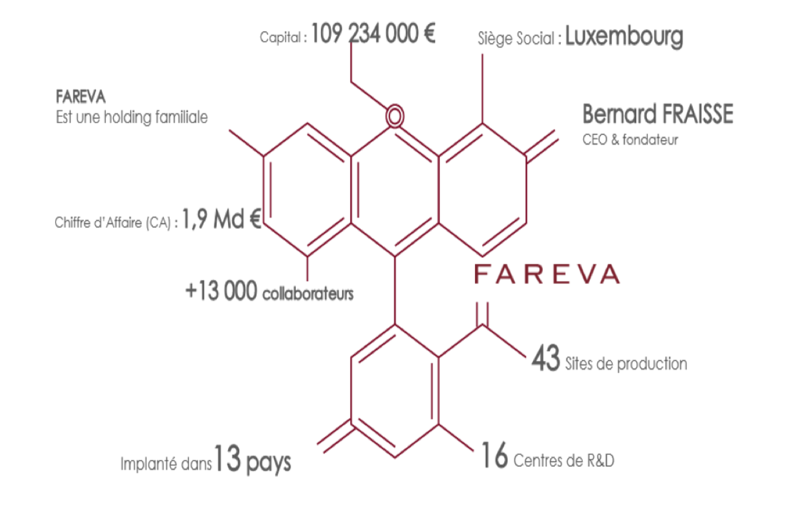
# Déf CNQ
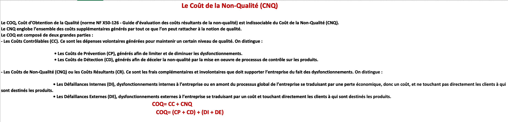
# CNQ
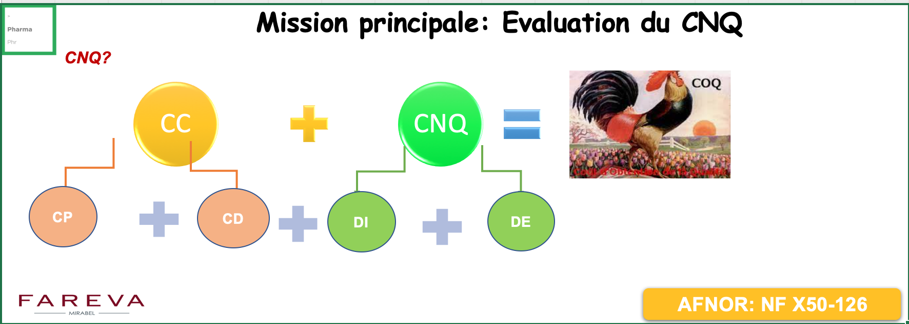
# Exemples
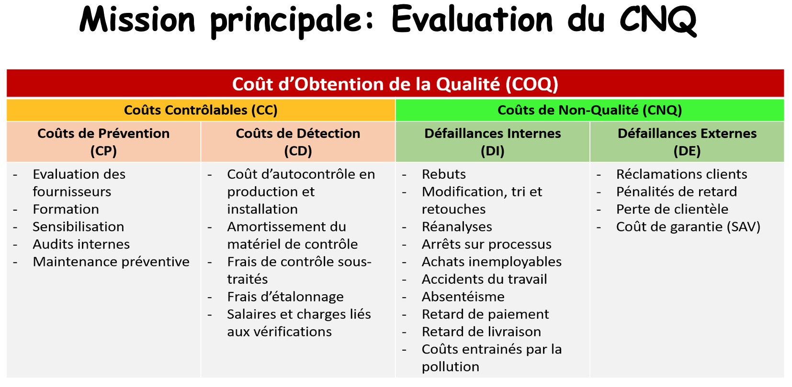
# Méthodologie
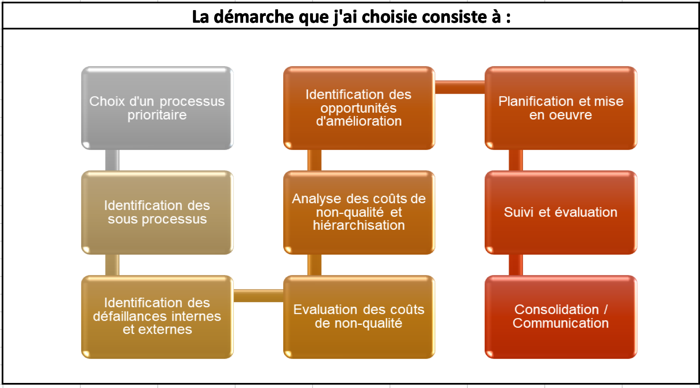
# DI & DE
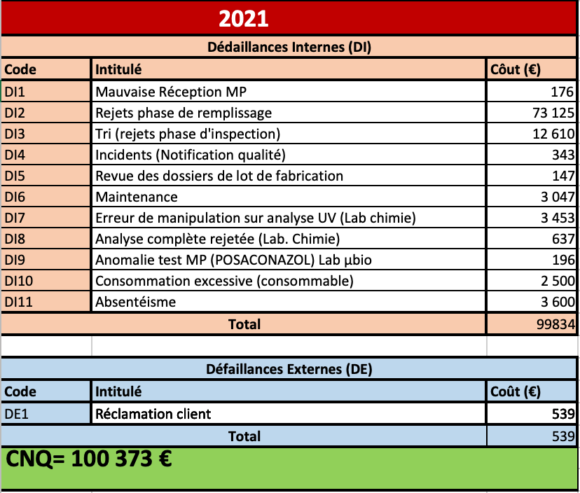
# PARETO
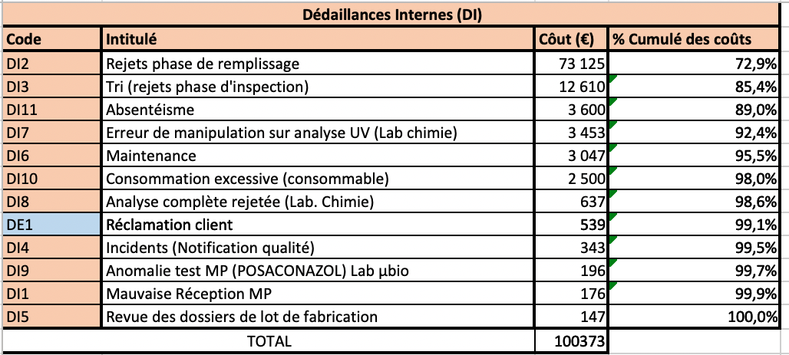
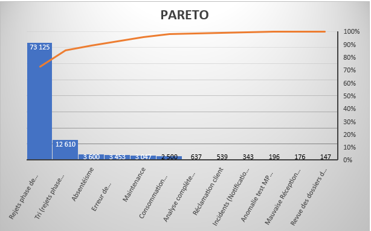
# Matrice de HOSHIN
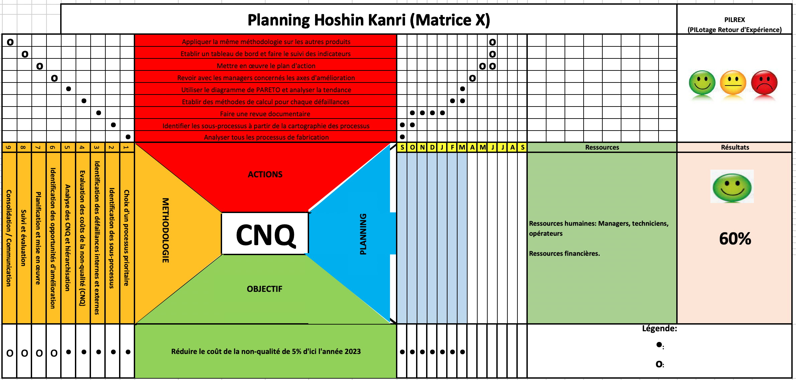
# GANTT
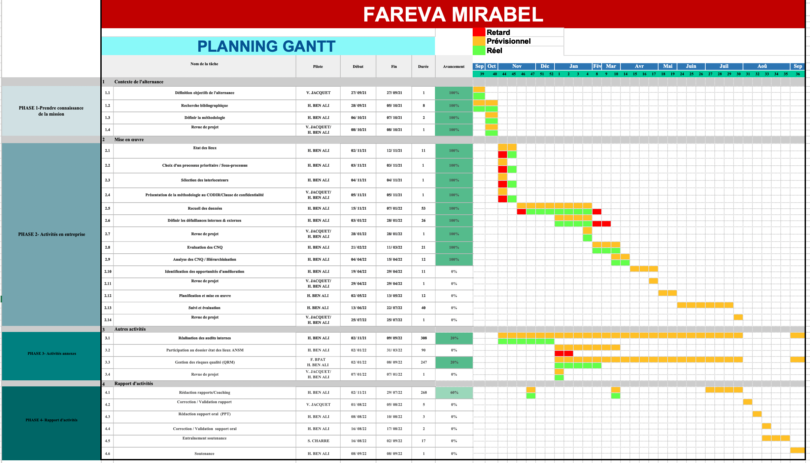
# Indic. d'avancement
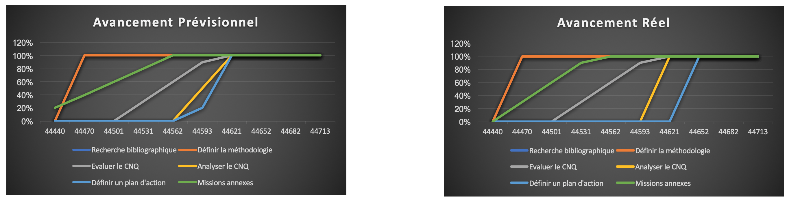
# Indic. de Performance
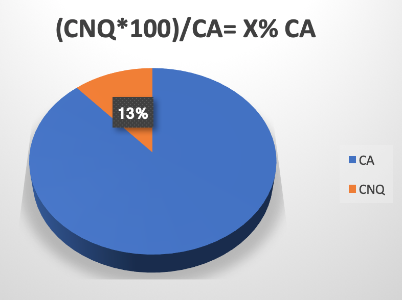
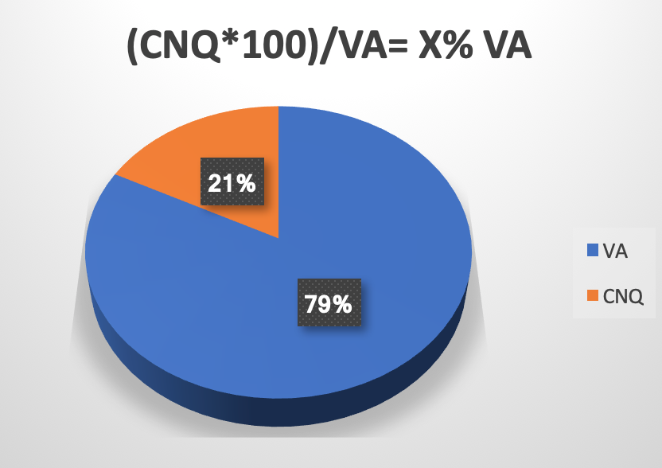
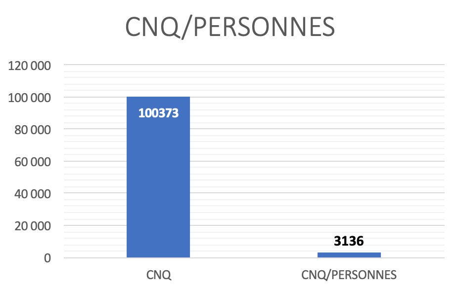

